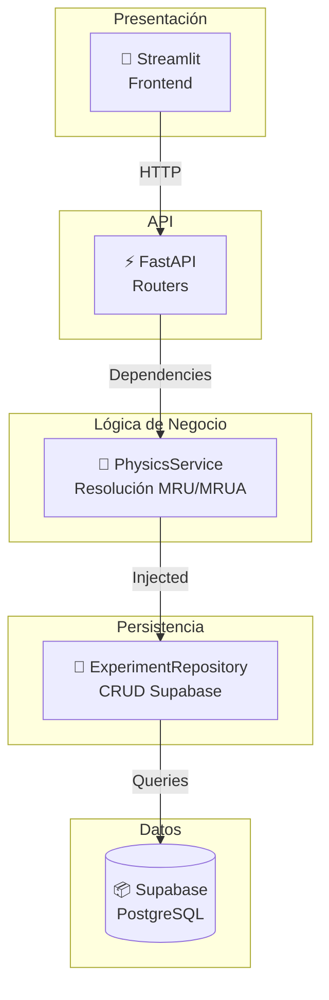

# Arquitectura

Esta sección explica cómo está organizado PhysiLab, por qué cada componente existe y cómo interactúan entre sí.

---

## 🎯 Principios de diseño

1. **Separación de responsabilidades**: Cada capa maneja una concern específica.
2. **Bajo acoplamiento**: Las capas se comunican mediante interfaces definidas.
3. **Escalabilidad**: Agregar nuevos modelos físicos no rompe el flujo existente.
4. **Validación temprana**: Los errores se detectan lo antes posible.
5. **Persistencia agnóstica**: El código de física no depende de Supabase.

---

## 📂 Estructura del código

El proyecto usa la estructura `src/` para garantizar importaciones limpias y escalabilidad:

```
src/
├── app/                    # 🎨 Frontend (Streamlit)
│   ├── main.py             # Página de inicio
│   └── pages/              # Páginas de análisis (analisis.py, ensayos.py, mru.py)
│
├── api/                    # ⚡ API REST (FastAPI)
│   ├── main.py             # Aplicación FastAPI y CORS
│   ├── routers/
│   │   └── experiments.py   # Endpoints CRUD para experimentos
│   └── dependencies.py      # Inyección de dependencias
│
├── services/               # 🔬 Lógica de física y reglas de negocio
│   └── physics_service.py   # Cálculos MRU/MRUA y orquestación
│
├── storage/                # 💾 Acceso a datos (Supabase)
│   ├── base.py             # BaseRepository con cliente Supabase
│   └── experiment_repository.py  # CRUD de experimentos
│
├── schemas/                # 📋 Validación y serialización (Pydantic)
│   ├── experiment.py       # ExperimentCreate, ExperimentResponse
│   ├── mru.py              # MRUSchema
│   └── mrua.py             # MRUASchema
│
└── core/                   # ⚙️ Configuración y excepciones
    ├── config.py           # Variables de entorno (Supabase, FastAPI)
    └── exceptions.py       # Excepciones de dominio personalizadas
```

**Ventajas de la estructura `src/`:**
- Previene importaciones accidentales de archivos raíz.
- Facilita la distribución como paquete.
- Mejora la claridad en desarrollo e CI/CD.

---

## 🏗️ Diseño en capas



### Capa de Presentación (Frontend)

**Componentes**: Streamlit  
**Ubicación**: `src/app/`

Responsabilidades:
- Capturar entrada del usuario (formularios, validación UI).
- Invocar la API REST mediante HTTP.
- Mostrar resultados con visualizaciones interactivas.
- Gestionar estado de sesión del usuario.

**Páginas**:
- `main.py`: Página de inicio con métricas del proyecto.
- `pages/mru.py`: Formulario para registrar MRU.
- `pages/ensayos.py`: Listado y gestión de experimentos.
- `pages/analisis.py`: Análisis gráfico de resultados.

!!! info "Independencia"
    Streamlit no conoce detalles de Supabase o la lógica física. Solo consume la API.

---

### Capa de API (FastAPI)

**Ubicación**: `src/api/`

Responsabilidades:
- Exponer endpoints REST con validación automática.
- Convertir requests HTTP a objetos de dominio.
- Inyectar dependencias (PhysicsService, repositorios).
- Manejar errores y convertirlos a respuestas HTTP.
- Documentación automática con OpenAPI (Swagger).

**Endpoints principales** (`src/api/routers/experiments.py`):
```
POST   /experiments/calculate/mru    → Crear y guardar MRU
POST   /experiments/calculate/mrua   → Crear y guardar MRUA
GET    /experiments                   → Listar todos
GET    /experiments/{id}              → Obtener detalles
DELETE /experiments/{id}              → Eliminar
```

**CORS**: Configurado para aceptar requests desde Streamlit (localhost:8501).

!!! tip "Inyección de dependencias"
    FastAPI inyecta `PhysicsService` automáticamente en cada endpoint, garantizando instancias únicas.

---

### Capa de Lógica de Negocio

**Componentes**: `PhysicsService`  
**Ubicación**: `src/services/physics_service.py`

Responsabilidades:
- **Cálculos físicos**: Resuelve variables faltantes en MRU y MRUA.
- **Orquestación**: Coordina entre API, esquemas y repositorio.
- **Validación de dominio**: Detecta inconsistencias en datos físicos.
- **Manejo de excepciones**: Lanza excepciones tipadas para errores específicos.

**Métodos principales**:
```python
resolver_y_guardar_mru(nombre: str, datos: MRUSchema)
resolver_y_guardar_mrua(nombre: str, datos: MRUASchema)
list_all()
get_one(exp_id: int)
remove_one(exp_id: int)
```

**Ejemplo: Resolución MRU**
```python
if datos.distancia is None:
    datos.distancia = datos.velocidad * datos.tiempo
elif datos.tiempo is None:
    datos.tiempo = datos.distancia / datos.velocidad  # Con validación
elif datos.velocidad is None:
    datos.velocidad = datos.distancia / datos.tiempo
```

!!! warning "Responsabilidad única"
    El servicio resuelve física, NO maneja HTTP o SQL directamente.

---

### Capa de Persistencia

**Componentes**: `ExperimentRepository` (hereda de `BaseRepository`)  
**Ubicación**: `src/storage/`

**BaseRepository** (`base.py`):
- Inicializa cliente Supabase singleton.
- Maneja conexión y errores de DB.
- Define métodos base para CRUD.

**ExperimentRepository** (`experiment_repository.py`):
- Implementa métodos específicos para `experiments` table.
- Convierte objetos Pydantic a registros SQL.
- Reconstruye modelos desde resultados de DB.

**Métodos**:
```python
create_mru_experiment(experiment: ExperimentCreate, physics_data: dict)
create_mrua_experiment(experiment: ExperimentCreate, physics_data: dict)
get_all() → List[ExperimentResponse]
get_by_id(exp_id: int) → ExperimentResponse
delete(exp_id: int) → bool
```

!!! info "Supabase"
    Usa PostgreSQL como motor. Las tablas son sincronizadas mediante migrations (versión futuro).

---

### Capa de Datos

**Sistema**: Supabase PostgreSQL

**Tablas principales**:
```sql
experiments (
    id SERIAL PRIMARY KEY,
    nombre VARCHAR(100),
    tipo VARCHAR(20),  -- 'MRU' o 'MRUA'
    fecha_creacion TIMESTAMP,
    -- Datos específicos por tipo
)

experiments_mru (
    id INT PRIMARY KEY REFERENCES experiments(id),
    velocidad FLOAT,
    tiempo FLOAT,
    distancia FLOAT
)

experiments_mrua (
    id INT PRIMARY KEY REFERENCES experiments(id),
    aceleracion FLOAT,
    velocidad_inicial FLOAT,
    velocidad_final FLOAT,
    posicion_inicial FLOAT,
    posicion_final FLOAT,
    tiempo FLOAT
)
```

!!! info "Normalización"
    Las tablas de física están normalizadas para escalabilidad y claridad.

---

## 🔄 Flujo de operación típica

### 1. Usuario registra un MRU desde Streamlit

```
┌─────────────────────────────────────────────────┐
│ Usuario ingresa: v=10 m/s, t=5 s                │
│ Nombre: "Ensayo de caída libre"                 │
└─────────────────────────────────────────────────┘
            ↓
┌─────────────────────────────────────────────────┐
│ Streamlit valida entrada (UI básica)            │
│ Construye JSON:                                 │
│ {nombre, datos: {velocidad, tiempo}}            │
└─────────────────────────────────────────────────┘
            ↓ HTTP POST
┌─────────────────────────────────────────────────┐
│ FastAPI (POST /experiments/calculate/mru)       │
│ Deserializa entrada → MRUSchema                 │
│ Crea instancia PhysicsService                   │
└─────────────────────────────────────────────────┘
            ↓ método
┌─────────────────────────────────────────────────┐
│ PhysicsService.resolver_y_guardar_mru()         │
│ • Calcula: distancia = 10 × 5 = 50 m           │
│ • Valida que no hay división por cero           │
│ • Inyecta repository                            │
└─────────────────────────────────────────────────┘
            ↓ INSERT
┌─────────────────────────────────────────────────┐
│ Repository.create_mru_experiment()              │
│ Inserta en tables experiments + experiments_mru │
│ Retorna ID = 1, fecha_creacion = NOW()          │
└─────────────────────────────────────────────────┘
            ↓ JSON
┌─────────────────────────────────────────────────┐
│ Resultado retorna al navegador:                 │
│ {id, nombre, tipo, fecha_creacion, distancia}   │
└─────────────────────────────────────────────────┘
            ↓
┌─────────────────────────────────────────────────┐
│ Streamlit renderiza resultado con Plotly        │
│ Muestra: ✅ "Ensayo guardado: 50 m calculados"  │
└─────────────────────────────────────────────────┘
```

---

## 🛡️ Manejo de errores

Las excepciones están organizadas por tipo en `src/core/exceptions.py`:

```python
class AppError(Exception)                    # Base
    ├── NotFoundError(resource, id)         # 404
    ├── DuplicateError(resource, field)     # 409
    ├── ValidationError(message)            # 422
    ├── StorageError(operation, detail)     # 502
    └── [Excepciones físicas]
        ├── ErrorDivisionPorCeroFisica      # División por 0
        └── ErrorDiscriminanteNegativo      # Discriminante < 0
```

Los routers capturan estas excepciones y las convierten en respuestas HTTP:
- `AppError` → 400 Bad Request
- `NotFoundError` → 404 Not Found
- `StorageError` → 502 Bad Gateway

---

## 🚀 Escalabilidad futura

La arquitectura está diseñada para crecer:

### Agregar modelo físico (ej: Fuerzas)

1. Crear `src/schemas/fuerza.py` con `FuerzaSchema`.
2. Agregar método `resolver_y_guardar_fuerza()` en `PhysicsService`.
3. Crear endpoint `POST /experiments/calculate/fuerza` en router.
4. Extender tabla Supabase con `experiments_fuerza`.
5. Crear página Streamlit `pages/fuerza.py`.

**Nada rompe en el código existente.**

### Migrar persistencia (ej: MongoDB)

1. Crear `MongoRepository` heredando de `BaseRepository`.
2. Reemplazar inyección de dependencias en FastAPI.
3. Implementar métodos CRUD para MongoDB.

**PhysicsService y FastAPI permanecen intactos.**

---

## 📊 Dependencias principales

| Librería | Capa | Propósito |
| --- | --- | --- |
| **Pydantic** | Schemas | Validación y serialización JSON |
| **FastAPI** | API | Framework REST |
| **Streamlit** | Frontend | Interfaz web interactiva |
| **Supabase** | Storage | Cliente PostgreSQL |
| **NumPy** | Services | Cálculos matemáticos |
| **Plotly** | Frontend | Visualizaciones gráficas |

---

## 🔗 Resumen de relaciones

```
┌──────────────────────────────────────────────────────────┐
│                      DEPENDENCIES                         │
├──────────────────────────────────────────────────────────┤
│ API Router                                               │
│   ↓ inyecta                                              │
│ PhysicsService                                           │
│   ↓ contrata                                             │
│ ExperimentRepository                                     │
│   ↓ hereda de                                            │
│ BaseRepository                                           │
│   ↓ usa                                                  │
│ Supabase Client                                          │
│   ↓ conecta a                                            │
│ PostgreSQL (experiments, experiments_mru, experiments_mrua) │
└──────────────────────────────────────────────────────────┘
```

!!! success "Resultado"
    Una arquitectura modular, testeable y escalable que permite experimentación rápida y mantenimiento a largo plazo.
