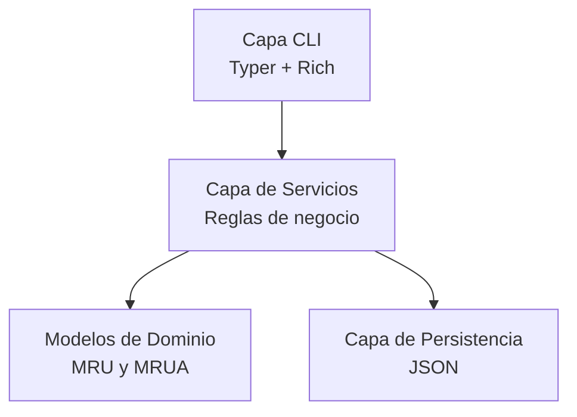

# Arquitectura

Esta sección explica cómo está organizado PhysiLab y por qué su diseño es fácil de mantener y escalar.

## Estructura de código

El proyecto usa una estructura src para separar claramente el código de aplicación del resto del repositorio.

```text
src/
  mi_app/
    cli.py
    services.py
    storage.py
    models/
```

Ventajas principales:

- Importaciones más seguras en desarrollo y CI.
- Mejor separación de responsabilidades.
- Base más limpia para empaquetado y crecimiento.

## Diseño por capas



### Capa CLI

- Recibe y valida argumentos de comandos.
- Construye objetos de dominio.
- Muestra resultados y errores de forma legible.

### Capa de servicios

- Contiene reglas de negocio.
- Resuelve variables físicas faltantes.
- Lanza excepciones de dominio cuando hay inconsistencias.

### Modelos de dominio

- Representan entidades físicas con dataclasses.
- Aplican validaciones tempranas.
- Definen atributos tipados para cálculos confiables.

### Capa de persistencia

- Carga y guarda experimentos en JSON.
- Reconstruye instancias de modelos al leer.
- Mantiene desacople con la lógica de negocio.

## Flujo de una operación típica

1. Usuario ejecuta un comando en la terminal.
2. La CLI crea el modelo con los datos de entrada.
3. El servicio valida y resuelve variables.
4. Storage persiste el resultado.
5. La CLI imprime confirmación al usuario.

## Principios aplicados

- Responsabilidad única por módulo.
- Bajo acoplamiento entre capas.
- Validación temprana para fallar rápido.
- Nombres de dominio explícitos y mantenibles.

!!! info "Escalabilidad"
    La arquitectura permite agregar nuevos modelos físicos o nuevos backends de persistencia sin romper el flujo existente.
