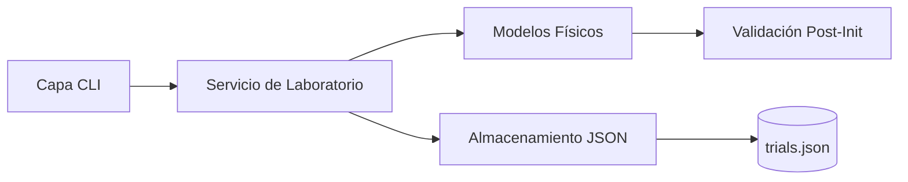
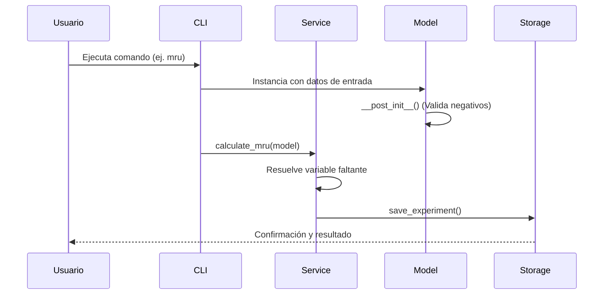

# 🔬 PhysiLab: CLI de Laboratorio de Cinemática

Bienvenido a la documentación oficial de **PhysiLab**, un cuaderno de laboratorio digital diseñado para gestionar, calcular y persistir ensayos de movimiento rectilíneo (MRU y MRUA) mediante una interfaz de línea de comandos moderna en Python.

Este proyecto implementa estándares profesionales como **Clean Code**, **Validación de Dominio** y **Arquitectura por Capas**.

---

## ✨ Características Principales

- **Solucionador de Física Automático**: Calcula variables faltantes (distancia, tiempo, velocidad, aceleración) de forma automática.
- **Integridad de Datos**: Basado en `dataclasses` de Python y validación `__post_init__` para evitar datos físicamente imposibles (ej. tiempos negativos).
- **Persistencia Robusta**: Serialización automática en formato JSON de todos tus ensayos de laboratorio.
- **Interfaz CLI Intuitiva**: Gestión de ensayos simple y rápida desde la terminal.
- **Altos Estándares de Calidad**: Código verificado con **Radon** (Complejidad Ciclomática A) y **Ruff**.

---

## 📦 Arquitectura del Sistema

PhysiLab sigue una arquitectura modular para garantizar que el código sea fácil de mantener y escalar.



---

## 🧠 Principios de Ingeniería Aplicados

!!! info "Clean Code y Diseño"
    - Responsabilidad Única: Cada clase y módulo tiene una sola razón para cambiar.
    - Encapsulamiento: Los modelos protegen su propio estado mediante validaciones internas.
    - Inversión de Dependencias: Los servicios dependen de abstracciones para el almacenamiento.
    - Tipado Estático: Uso intensivo de Type Hints para un desarrollo libre de errores.

---

## 📁 Estructura del Proyecto

```text
physilab-project/
├── data/               # Archivos JSON persistentes
├── docs/               # Documentación técnica (MkDocs)
├── src/mi_app/
│   ├── models/         # Entidades físicas (MRU, MRUA)
│   ├── services.py     # Lógica de negocio y cálculos
│   ├── storage.py      # Capa de persistencia
│   └── cli.py          # Capa de interfaz (CLI)
└── tests/              # Pruebas automatizadas
```

## 🚀 Flujo General de Ejecución
Este diagrama muestra cómo interactúan las capas cuando registras un nuevo ensayo:



---

## 📚 Cómo navegar esta documentación

| Sección | Contenido |
| --- | --- |
| Primeros pasos | Instalación con uv y configuración inicial. |
| Guía de usuario | Ejemplos detallados de comandos y uso de la CLI. |
| Arquitectura | Decisiones de diseño y principios de código limpio. |
| Referencia | Documentación técnica generada automáticamente del código. |

---

!!! tip "Recomendación"
    Si es tu primera vez usando el proyecto, te recomendamos empezar por la sección Primeros pasos.