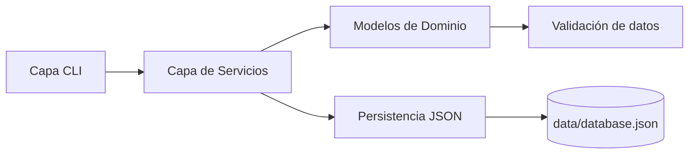
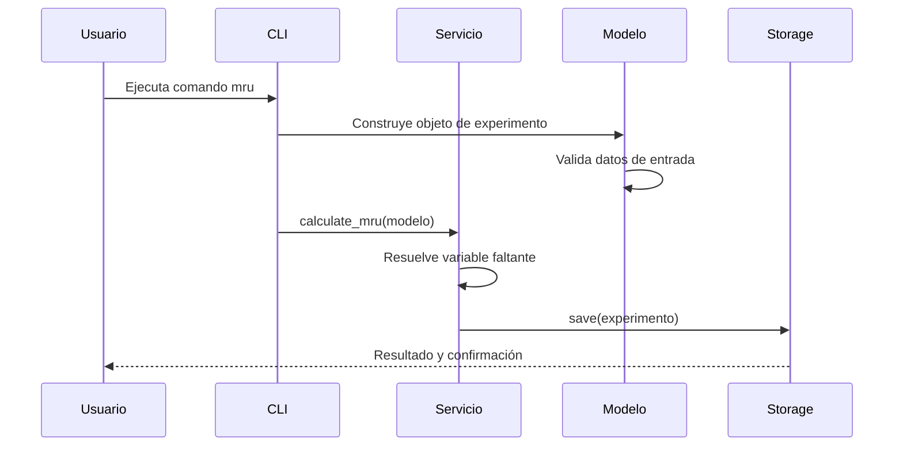

# 🔬 PhysiLab: Laboratorio de Cinemática por CLI

Bienvenido a la documentación oficial de PhysiLab, una aplicación de línea de comandos para registrar, calcular y persistir ensayos de movimiento rectilíneo.

Está pensada para aprendizaje, práctica de ingeniería de software y experimentación rápida en terminal.

---

## ✨ Qué puedes hacer con PhysiLab

- Registrar ensayos con identificador y nombre.
- Calcular automáticamente la variable faltante en MRU.
- Mantener historial persistente en JSON local.
- Consultar y eliminar experimentos desde la CLI.
- Trabajar con una arquitectura modular y mantenible.

---

## 🧠 Conceptos que aprenderás

- Modelado de dominio con dataclasses.
- Validación de datos físicos y reglas de negocio.
- Arquitectura por capas aplicada a una CLI real.
- Persistencia desacoplada usando almacenamiento JSON.
- Documentación técnica con MkDocs + Material.

---

## 🏗️ Arquitectura del sistema

---

## 🚀 Flujo general de ejecución

---

## 📚 Navegación de la documentación

| Sección | Contenido |
| --- | --- |
| Primeros pasos | Instalación, configuración y primera ejecución |
| Guía de usuario | Uso práctico de comandos y persistencia |
| Arquitectura | Diseño técnico, capas y decisiones clave |
| Referencia | Documentación API generada desde el código |

!!! tip "Recomendación"
    Si es tu primera vez con el proyecto, comienza por Primeros pasos y luego continúa con Guía de usuario.