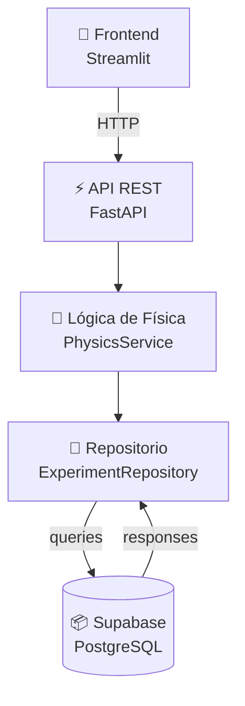
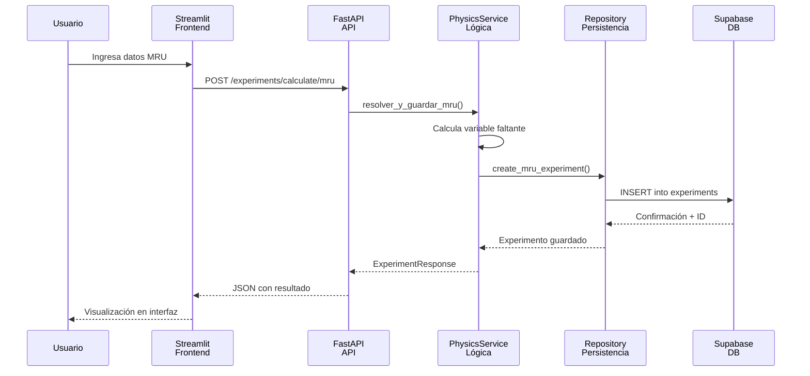

# 🔬 PhysiLab: Cuaderno de Laboratorio Digital

Bienvenido a la documentación oficial de **PhysiLab**, una plataforma web modular para registrar, analizar y persistir ensayos de movimiento rectilíneo uniforme (MRU) y uniformemente acelerado (MRUA).

PhysiLab está construido como una arquitectura escalable con **Frontend** (Streamlit), **API REST** (FastAPI) y **Base de datos** (Supabase), ideal para aprendizaje en ingeniería de software, experimentación educativa y prácticas de laboratorio digital.

---

## ✨ Qué puedes hacer con PhysiLab

- **Registrar ensayos** de MRU y MRUA con interfaz web amigable.
- **Calcular automáticamente** variables faltantes usando motor matemático con NumPy.
- **Gestionar historial persistente** en Supabase con sincronización en tiempo real.
- **Acceder a la API REST** para integración con otras herramientas.
- **Analizar resultados** con visualizaciones interactivas mediante Plotly.
- **Escalar a nuevos modelos** de física (fuerzas, energías) sin romper la arquitectura.

---

## 🧠 Conceptos clave del proyecto

- Modelado de dominio con Pydantic (validación y serialización).
- Arquitectura por capas (Presentación, Lógica de Negocio, Persistencia).
- Separación de responsabilidades entre Frontend y API.
- Validación temprana de datos físicos y reglas de negocio.
- Persistencia desacoplada mediante repositorios abstractos.
- Documentación técnica con MkDocs + Material y OpenAPI automático.

---

## 🏗️ Arquitectura del sistema

---

## 🚀 Flujo general de una operación

---

## 📚 Navegación de la documentación

| Sección | Contenido |
| --- | --- |
| **Primeros pasos** | Instalación, configuración de Supabase y primera ejecución |
| **Guía de usuario** | Uso del Frontend, API REST y consulta de resultados |
| **Arquitectura** | Diseño técnico, capas, patrones y decisiones clave |
| **Referencia** | Documentación API (OpenAPI), esquemas y servicios |

!!! tip "Recomendación"
    Si es tu primera vez, comienza por **Primeros pasos**, luego explora la **Guía de usuario**. Para entender el diseño interno, consulta **Arquitectura**.