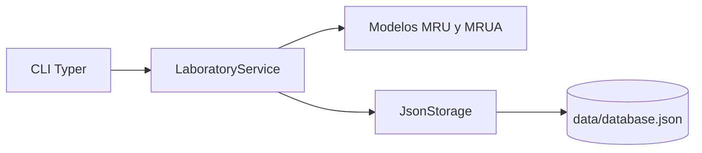

# PhysiLab

Cuaderno de laboratorio digital para registrar ensayos de cinematica desde una CLI en Python.

## Proposito del proyecto

PhysiLab busca resolver un problema concreto: convertir ejercicios y ensayos de movimiento en registros reproducibles, trazables y faciles de consultar.

Con la aplicacion puedes:

- crear ensayos de MRU y MRUA;
- delegar al servicio el calculo de variables faltantes;
- persistir resultados en un archivo JSON local;
- listar y eliminar ensayos desde comandos simples.

## Caracteristicas principales

- CLI construida con Typer para una experiencia de uso clara.
- Salida tabular con Rich para inspeccionar resultados rapidamente.
- Modelos tipados con dataclasses y validaciones de dominio.
- Capa de servicios con logica fisica separada de la persistencia.
- Persistencia JSON desacoplada mediante protocolo de almacenamiento.
- Documentacion automatica de API con mkdocstrings.

## Arquitectura general

La arquitectura se divide en tres capas para mantener bajo acoplamiento:

- Presentacion: comandos CLI y renderizado de resultados.
- Dominio y aplicacion: modelos + servicios con reglas de negocio.
- Infraestructura: almacenamiento JSON para carga/guardado de ensayos.

Para comenzar con instalacion y primer uso, revisa la seccion **Primeros pasos**.